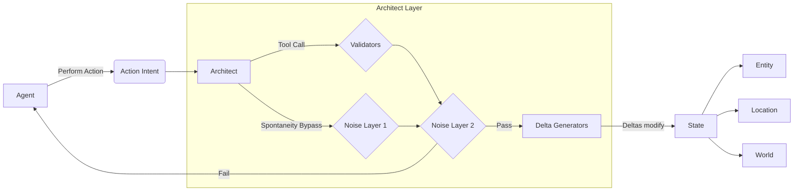

# Architect

The architect is not a specialized model. Neither is it a special entity. The architect isn't a an entity that inherits `AttributableObject` either. Instead, it is a special context along with a set of tools that is given to an LLM that dictates what happens to our world state.

The Architect (context) is provided with the WorldState, states of entities, state of a scene, location, along with their attributes and is asked to judge weather an action (later an `Intent`) makes canonical sense or not (for example, item ownership, entity location and state tracking) and disallows intents that break the narrative flow completely.

For now, dialogue intents are exempted from validation system and are not used for state manipulation. Dialogues fall more into the domain of the [Perception Engine (Deferred)]() and [memory systems (nlavs)]().

v0 defers atomic validators completely. Instead an umbrella LLM based validator is used for validating the intent (action) generated based on spatial knowledge and heuristic physics.

## Dyamic Validators (Deferred from V0)

There are will a [standard set of Validators]() that dictate if an action is possible or not. The architect can, however, dynamically generate its own set of Validators which can be loaded and unloaded during runtime based on narration. These Validators can be soft validators (if they fail they're sent back to the entity for override confirmation.)

## RNG and Noise Layers (Deferred from v0)

> [!NOTE]
> Documenting story flattening problem.

Since we're have such complex systems for action validation, it's possible that the LLM would naturally steer towards low stakes actions or actions with minimal consequences. That way the narrative would simply flatten out. Which is why there needs to exist a noise layer that would allow for random (slightly non-sensible) actions to take place to introduce Spontaneity and unexpectedness into the system. (See dynamic temperature tweaking)
