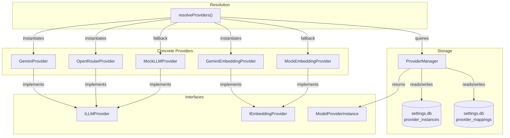
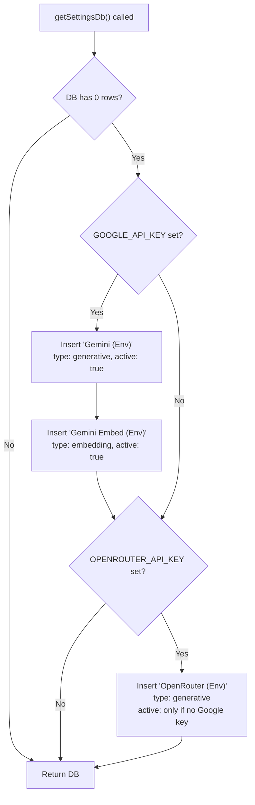

# @omnia/llm

LLM abstraction layer providing pluggable, database-backed provider instances for generative and embedding tasks.

## Architecture Overview

The system is built around three layers:

1. **Interfaces** — contracts that all providers implement
2. **Provider Manager** — SQLite-backed CRUD for persisted provider instances
3. **Provider Resolver** — runtime instantiation of concrete provider classes from stored instances



## Core Interfaces

Defined in [`llm.ts`](src/llm.ts):

### `ILLMProvider`

The primary contract for generative (text-to-structured-data) providers.

| Member                                   | Type                      | Description                                                |
| ---------------------------------------- | ------------------------- | ---------------------------------------------------------- |
| `providerName`                           | `string`                  | Human-readable provider label                              |
| `maxContext`                             | `number?`                 | Maximum context window in tokens                           |
| `generateStructuredResponse<T>(request)` | `Promise<LLMResponse<T>>` | Sends a prompt + Zod schema → returns parsed, typed output |
| `lastCalls`                              | `LLMCallRecord[]?`        | Audit trail of recent calls (prompts + usage)              |

### `IEmbeddingProvider`

Contract for text-to-vector embedding providers.

| Member         | Type                | Description                                        |
| -------------- | ------------------- | -------------------------------------------------- |
| `providerName` | `string`            | Human-readable provider label                      |
| `embed(text)`  | `Promise<number[]>` | Returns a dense vector embedding of the input text |

### `LLMRequest<T>`

Input to `generateStructuredResponse`:

```typescript
{
  systemPrompt: string;    // System-level instructions
  userContext:   string;    // User/task-specific context
  schema:        T;         // Zod schema — output is validated against this
  temperature?:  number;    // Sampling temperature (optional)
}
```

### `LLMResponse<T>`

Output from `generateStructuredResponse`:

```typescript
{
  success: boolean;
  data?:   T;               // Parsed, schema-validated output
  error?:  string;          // Error message on failure
  usage?:  {
    inputTokens:          number;
    outputTokens:         number;
    totalTokens:          number;
    modelName?:           string;
    providerInstanceName?: string;
    maxContext?:           number;
  };
}
```

### `ModelProviderInstance`

The persisted configuration record for a single provider instance:

```typescript
{
  id:           string;                     // Unique ID ("provider-<timestamp>")
  name:         string;                     // User-facing name ("Gemini (Env)")
  providerName: string;                     // Provider type key ("google-genai" | "openrouter" | "mock")
  apiKey:       string;                     // API key
  isActive:     boolean;                    // Whether this is the active instance for its type
  modelName?:   string;                     // Specific model to use
  type:         "generative" | "embedding"; // Instance category
  maxContext?:  number;                     // Context window limit
}
```

### `ModelProviderMeta`

Static metadata for each available provider type (used by the UI's provider picker):

| Member                  | Type     | Description                                                  |
| ----------------------- | -------- | ------------------------------------------------------------ |
| `id`                    | `string` | `"google-genai"` \| `"openrouter"` \| `"ollama"` \| `"mock"` |
| `displayName`           | `string` | Human-readable name                                          |
| `description`           | `string` | Human-readable description                                   |
| `defaultModel`          | `string` | Default generative model                                     |
| `defaultEmbeddingModel` | `string` | Default embedding model                                      |

The [`AVAILABLE_PROVIDERS`](src/llm.ts#L70-L103) constant exports all four provider metas.

## Provider Manager

[`ProviderManager`](src/provider-manager.ts) is a **static class** that provides full CRUD over provider instances, backed by a SQLite database (`data/settings.db` at the workspace root).

### Storage

The database is auto-created on first access. The table schema:

```sql
CREATE TABLE IF NOT EXISTS provider_instances (
  id           TEXT PRIMARY KEY,
  name         TEXT NOT NULL,
  providerName TEXT NOT NULL,
  apiKey       TEXT NOT NULL,
  isActive     INTEGER NOT NULL DEFAULT 0,
  modelName    TEXT,
  type         TEXT NOT NULL DEFAULT 'generative',
  maxContext   INTEGER
);
```

A second table stores per-task provider overrides:

```sql
CREATE TABLE IF NOT EXISTS provider_mappings (
  task                TEXT PRIMARY KEY,
  providerInstanceId  TEXT NOT NULL
);
```

### API

| Method                                                                    | Signature                         | Description                                                                               |
| ------------------------------------------------------------------------- | --------------------------------- | ----------------------------------------------------------------------------------------- |
| `list()`                                                                  | `→ ModelProviderInstance[]`       | Returns all saved instances                                                               |
| `create(name, providerName, apiKey, modelName?, type?, maxContext?)`      | `→ ModelProviderInstance`         | Creates a new instance. Auto-activates if it's the first of its type                      |
| `delete(id)`                                                              | `→ void`                          | Removes an instance. If it was active, auto-promotes the next instance of the same type   |
| `setActive(id)`                                                           | `→ void`                          | Deactivates all instances of the same type, then activates the target                     |
| `update(id, name, providerName, apiKey?, modelName?, type?, maxContext?)` | `→ void`                          | Updates an existing instance. If `apiKey` is empty/omitted, the existing key is preserved |
| `getActive(type?)`                                                        | `→ ModelProviderInstance \| null` | Returns the currently active instance for the given type (`"generative"` by default)      |
| `getMappings()`                                                           | `→ Record<string, string>`        | Returns all task → providerInstanceId mappings                                            |
| `setMapping(task, providerInstanceId)`                                    | `→ void`                          | Sets or removes (if `providerInstanceId` is empty) a task-specific mapping                |

### Active Instance Invariants

- **Only one active instance per type** — `setActive()` deactivates all sibling instances before activating the target.
- **Auto-promotion on delete** — if the deleted instance was active, the first remaining instance of the same type is promoted.
- **Auto-activation on create** — if no active instance exists for the type, the new instance is automatically activated.

### Environment Variable Bootstrap

On first database access (and if the `provider_instances` table is empty), the manager auto-seeds instances from environment variables:



This same bootstrap logic is **duplicated** inside `getActive()` as a safety net — if the DB is empty at query time, it re-attempts the same env-var seeding.

### Fallback Chain in `getActive()`

When no active row is found for the requested type:

```
1. DB query for isActive=1 AND type=<requested>
   ├── Found → return it
   └── Not found
       ├── DB is empty → bootstrap from env vars → retry query
       │   ├── Found → return it
       │   └── Still empty → promote first row of same type
       │       ├── Found → activate & return
       │       └── None → return null
       └── DB has rows but none active for this type
           → promote first row of same type (same as above)

2. On any DB error (catch block) → direct env var fallback
   ├── GOOGLE_API_KEY → synthetic "Gemini (Env Fallback)" instance
   ├── OPENROUTER_API_KEY → synthetic "OpenRouter (Env Fallback)" instance
   └── Neither → return null
```

## Available Providers

### Google Gemini — `GeminiProvider`

| Property                    | Value                                                        |
| --------------------------- | ------------------------------------------------------------ |
| **File**                    | [`providers/google-genai.ts`](src/providers/google-genai.ts) |
| **Provider ID**             | `google-genai`                                               |
| **SDK**                     | `@langchain/google-genai` (`ChatGoogleGenerativeAI`)         |
| **Default Model**           | `gemini-2.5-flash`                                           |
| **Default Embedding Model** | `gemini-embedding-001`                                       |
| **Default Max Context**     | `32768`                                                      |
| **Type**                    | Generative                                                   |

**Key resolution** in the constructor follows this cascade:

```
1. Explicit apiKey argument       → use it
2. ProviderManager.getActive()    → if providerName matches "google-genai"
3. GOOGLE_API_KEY env var         → final fallback
4. None found                     → throw Error
```

Also exports `GeminiEmbeddingProvider` (implements `IEmbeddingProvider`) using the same key resolution pattern but querying for the `"embedding"` type.

### Anthropic Claude — `AnthropicProvider`

| Property                    | Value                                                  |
| --------------------------- | ------------------------------------------------------ |
| **File**                    | [`providers/anthropic.ts`](src/providers/anthropic.ts) |
| **Provider ID**             | `anthropic`                                            |
| **SDK**                     | `@langchain/anthropic` (`ChatAnthropic`)               |
| **Default Model**           | `claude-3-5-sonnet-latest`                             |
| **Default Embedding Model** | _(none)_                                               |
| **Default Max Context**     | `200000`                                               |
| **Type**                    | Generative only (no embedding provider)                |

**Key resolution** in the constructor follows this cascade:

```
1. Explicit apiKey argument       → use it
2. ProviderManager.getActive()    → if providerName matches "anthropic"
3. ANTHROPIC_API_KEY env var      → final fallback
4. None found                     → throw Error
```

### OpenRouter — `OpenRouterProvider`

| Property                    | Value                                                    |
| --------------------------- | -------------------------------------------------------- |
| **File**                    | [`providers/openrouter.ts`](src/providers/openrouter.ts) |
| **Provider ID**             | `openrouter`                                             |
| **SDK**                     | `@langchain/openrouter` (`ChatOpenRouter`)               |
| **Default Model**           | `google/gemini-2.5-flash`                                |
| **Default Embedding Model** | `openai/text-embedding-3-small`                          |
| **Default Max Context**     | `32768`                                                  |
| **Type**                    | Generative only (no embedding provider)                  |

Same three-step key resolution as Gemini (`explicit → ProviderManager → env var`), using `OPENROUTER_API_KEY`.

### Ollama — `OllamaProvider`

| Property                    | Value                                            |
| --------------------------- | ------------------------------------------------ |
| **File**                    | [`providers/ollama.ts`](src/providers/ollama.ts) |
| **Provider ID**             | `ollama`                                         |
| **SDK**                     | `@langchain/ollama` (`ChatOllama`)               |
| **Default Model**           | `llama3.1`                                       |
| **Default Embedding Model** | `nomic-embed-text`                               |
| **Default Max Context**     | `32768`                                          |
| **Type**                    | Generative + Embedding                           |

Ollama runs **locally** — no API key is required. The `endpointUrl` field in `ModelProviderInstance` stores the Ollama server base URL (default: `http://localhost:11434`).

**Key resolution** in the constructor:

```
1. Explicit baseUrl argument        → use it
2. ProviderManager.getActive()      → if providerName matches "ollama"
                                      (endpointUrl field = base URL)
3. Default                          → http://localhost:11434
```

Also exports `OllamaEmbeddingProvider` (implements `IEmbeddingProvider`), which uses the same resolution pattern against the `"embedding"` type instance. The default embedding model is `nomic-embed-text`.

> [!TIP]
> To get started: `ollama pull llama3.1` and `ollama pull nomic-embed-text`. Then create a provider instance with `endpointUrl` = `http://localhost:11434`.

### Mock — `MockLLMProvider`

| Property        | Value                                        |
| --------------- | -------------------------------------------- |
| **File**        | [`providers/mock.ts`](src/providers/mock.ts) |
| **Provider ID** | `mock`                                       |
| **Type**        | Generative + Embedding                       |

Stateless mock for testing and offline development:

- **Generative** (`MockLLMProvider`): Takes an array of canned responses at construction. Returns them in order, one per call. Returns `{ success: false, error: "Mock responses exhausted" }` when depleted.
- **Embedding** (`MockEmbeddingProvider`): Returns a deterministic 768-dimensional vector derived from the input text using `Math.sin`.

## Provider Resolution (Runtime)

The [`resolveProviders()`](../../../apps/gui/src/lib/simulation/provider-resolver.ts) function (in `apps/gui`) instantiates all providers needed for a simulation session. It resolves **six** provider slots:

| Slot                | Type       | Task Key           |
| ------------------- | ---------- | ------------------ |
| `actorProvider`     | Generative | `"actor-prose"`    |
| `validatorProvider` | Generative | `"llm-validator"`  |
| `decoderProvider`   | Generative | `"intent-decoder"` |
| `timedeltaProvider` | Generative | `"timedelta"`      |
| `handoffProvider`   | Generative | `"handoff"`        |
| `embeddingProvider` | Embedding  | `"embeddings"`     |

### Generative Resolution Order

For each generative slot (`resolveGenerative(task)`):

```
1. Task-specific mapping     → mappings[task] → find instance by ID
2. Active generative instance → ProviderManager.getActive("generative")
3. Fallback instance         → options.fallbackInstance (if provided)
4. GOOGLE_API_KEY env var    → auto-create via ProviderManager.create()
5. No provider available     → throw Error (if required) or MockLLMProvider
```

### Embedding Resolution Order

For the embedding slot (`resolveEmbedding()`):

```
1. Task-specific mapping     → mappings["embeddings"] → find instance by ID
2. Active embedding instance → ProviderManager.getActive("embedding")
3. GOOGLE_API_KEY env var    → auto-create via ProviderManager.create()
4. No provider available     → throw Error (if required) or MockEmbeddingProvider
```

### Instance → Class Mapping

The `buildLLMProvider()` and `buildEmbeddingProvider()` functions perform the final dispatch:

| `providerName`    | Generative Class     | Embedding Class           |
| ----------------- | -------------------- | ------------------------- |
| `"google-genai"`  | `GeminiProvider`     | `GeminiEmbeddingProvider` |
| `"openrouter"`    | `OpenRouterProvider` | _(falls through to mock)_ |
| `"ollama"`        | `OllamaProvider`     | `OllamaEmbeddingProvider` |
| `"anthropic"`     | `AnthropicProvider`  | _(falls through to mock)_ |
| _(anything else)_ | `MockLLMProvider`    | `MockEmbeddingProvider`   |

## Structured Output

All real providers use LangChain's `.withStructuredOutput(schema, { includeRaw: true })` pattern:

```typescript
const structuredModel = this.model.withStructuredOutput(request.schema, {
  includeRaw: true,
});
const result = await structuredModel.invoke([
  { role: "system", content: request.systemPrompt },
  { role: "user", content: request.userContext },
]);
```

This sends the Zod schema to the model as a structured output constraint. The response includes both `parsed` (schema-validated data) and `raw` (full API response with usage metadata).

## Configuration

[`config.ts`](src/config.ts) parses environment variables using Zod:

| Variable             | Required | Description              |
| -------------------- | -------- | ------------------------ |
| `GOOGLE_API_KEY`     | No       | Google Gemini API key    |
| `OPENROUTER_API_KEY` | No       | OpenRouter API key       |
| `ANTHROPIC_API_KEY`  | No       | Anthropic Claude API key |

Both are optional because providers can also be configured through the database via the GUI settings page.

## File Map

```
packages/llm/
├── src/
│   ├── index.ts              # Re-exports everything
│   ├── llm.ts                # Interfaces, types, AVAILABLE_PROVIDERS
│   ├── config.ts             # Env var parsing (Zod)
│   ├── provider-manager.ts   # ProviderManager (SQLite CRUD)
│   └── providers/
│       ├── google-genai.ts   # GeminiProvider + GeminiEmbeddingProvider
│       ├── ollama.ts         # OllamaProvider + OllamaEmbeddingProvider
│       ├── openrouter.ts     # OpenRouterProvider
│       ├── anthropic.ts      # AnthropicProvider
│       └── mock.ts           # MockLLMProvider + MockEmbeddingProvider
├── tests/
│   ├── mock.test.ts
│   ├── openrouter.test.ts
│   └── provider-manager.test.ts
└── package.json
```
