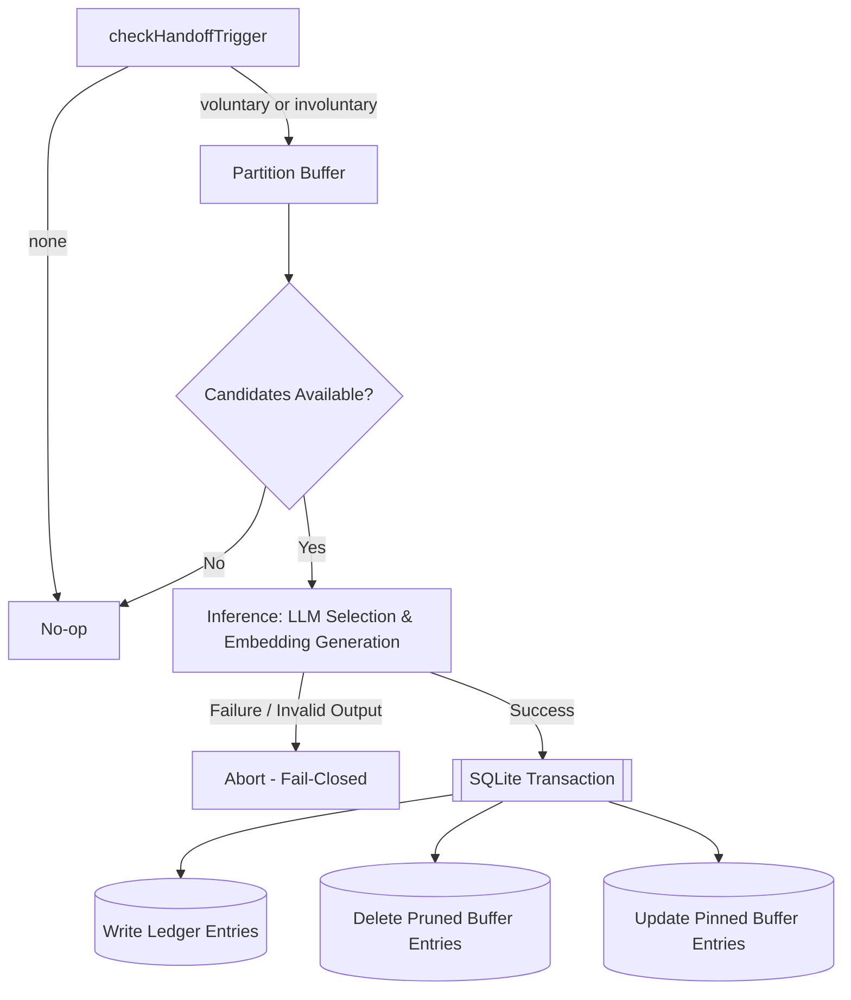

:::tip[Status: Fully Implemented]
The handoff pipeline is fully integrated into the simulation step loop. The `HandoffEngine` and `checkHandoffTrigger` components process working memory entries, promoting them to the persistent episodic Ledger, while safely pruning the subjective working memory buffer.
:::

The **Handoff** pipeline manages the promotion of subjective experiences from the short-term working memory (Tier 1 Buffer) to long-term episodic memory (Tier 2 Ledger). This process regulates context window utilization by deciding **when** promotion occurs, **how much** of the buffer is processed, and **what** details are preserved or pruned.

To maintain performance and prevent context bloat, the pipeline separates the process into three decoupled stages:

1. **Trigger Detection**: A deterministic, low-cost evaluation of entity and buffer state to determine if a promotion check is required.
2. **Watermark Partitioning**: A policy-driven boundary that separates recent memories (the watermark tail) from older promotion candidates.
3. **Structured Selection**: An LLM-driven synthesis step that summarizes, rates, and prunes candidate memories.

---

## 1. Trigger Detection

Trigger detection runs deterministically at the start of each entity's turn, without LLM overhead. The system categorizes triggers into voluntary (soft) and involuntary (hard) conditions.

```ts
type HandoffTrigger = "none" | "voluntary" | "involuntary";

function checkHandoffTrigger(
  entity: Entity,
  bufferEntries: BufferEntry[],
  now: Date,
  maxContext?: number,
): HandoffTrigger;
```

### Voluntary Triggers (Soft)

Voluntary triggers identify natural narrative boundaries where the entity is inactive or has transitioned contexts:

- **Scene Exit**: The entity's `locationId` changes relative to the location of the entries currently in the buffer, or the buffer contains entries spanning multiple different locations.
- **Idle Decay**: The entity has produced no external interactions (only monologue entries or no entries) for $N$ (default: 5) consecutive turns.
- **Attribute-Driven State**: A character attribute (e.g., `status: asleep` or `consciousness: unconscious`) signals low external activity.

### Involuntary Triggers (Hard)

Involuntary triggers enforce context constraints before building the next prompt to prevent token limit overflows:

- **Buffer Ceiling**: The serialized length of the working memory section (as generated by `getMemorySectionLength`) exceeds a configured fraction (default: 60%) of the provider's context window.
- **Event Velocity**: The number of buffer entries exceeds a safe threshold (default: 20), indicating an event-heavy scene generating history faster than voluntary boundaries occur.

If the buffer is empty, trigger detection exits immediately with `"none"`.

---

## 2. Watermark Partitioning

To preserve short-term narrative continuity and avoid immediate memory decay, recent events are protected from handoff. The pipeline divides the active buffer into a protected **Watermark Tail** and a **Candidate Pool**.

The watermark boundary is computed as:

$$\text{Watermark} = \max(K \text{ entries}, \text{entries bucketed as fresh by } \textit{naturalizeTime})$$

- **Hard Floor ($K = 8$)**: The last 8 entries in the buffer are always preserved.
- **Temporal Freshness**: Any entries that `naturalizeTime` classifies within the immediate temporal horizon (`"just now"`, `"moments ago"`, `"a few minutes ago"`, or `"several minutes ago"`) are also protected.

Entries older than the watermark boundary constitute the **Candidate Pool** and are eligible for handoff processing.

---

## 3. Structured Selection

Handoff promotion is executed via a single, structured LLM call per run. The engine maps candidate entries to Zod schemas to ensure type-safe integration.

```ts
const HandoffChunkSchema = z.object({
  sourceEntryIds: z.array(z.string()), // buffer entries consumed by this chunk
  content: z.string(), // third-person summary -> LedgerEntry.content
  quotes: z.array(z.string()), // verbatim, high-salience dialogue lines
  importance: z.number().int().min(1).max(10),
  involvedEntityIds: z.array(z.string()),
  retainInBuffer: z.boolean(), // keeps entries in buffer despite promotion
});

const HandoffResultSchema = z.object({
  chunks: z.array(HandoffChunkSchema),
});
```

### LLM Processing Rules

The prompt instructs the model to apply the following cognitive operations:

1. **Clustering**: Group related consecutive candidate entries into high-level narrative beats (e.g., consolidating an entire dialogue exchange into one beat).
2. **Third-Person Synthesis**: Write the `content` summary from a third-person narrative perspective.
3. **Dialogue Salience**: Extract verbatim quotes of high emotional or narrative relevance.
4. **Information Pruning (Forgetting)**: Any candidate entry ID omitted from all chunk `sourceEntryIds` is permanently deleted from the buffer and never saved to the ledger. This mirrors natural sensory attenuation.

### Unresolved Thread Retention (Pinning)

When a chunk represents an unresolved high-stakes situation (e.g., an active conflict or standing threat), the LLM sets `retainInBuffer: true`.

- The summary is committed to the long-term Ledger as normal.
- The source buffer entries are exempted from pruning, remaining in the working memory buffer with `pinned: true` until a future handoff pass determines the thread is resolved.

---

## 4. Transactional Execution

To prevent permanent memory loss (e.g., buffer entries being deleted without ledger entries being committed), the handoff execution pipeline operates under a strict **fail-closed** design.



If LLM inference, Zod schema validation, or vector embedding generation fails, the process aborts immediately. No database changes are written, and the trigger re-evaluates on the next turn.

---

## 5. Integration

The handoff pipeline is exposed via `HandoffEngine` and is wired directly into the simulation loop:

- **Turn Hook**: `SimulationManager.step()` invokes trigger evaluation and handoff resolution for all active entities at the start of the turn, before entities act.
- **Task Routing**: Handoff tasks are routed using the `"handoff"` routing key, enabling independent LLM provider selection and max context configuration.
- **Buffer Garbage Collection**: By combining memory promotion with automatic pruning, the handoff engine bounds buffer memory usage over long simulation runs, eliminating the need for a separate garbage collection mechanism.
