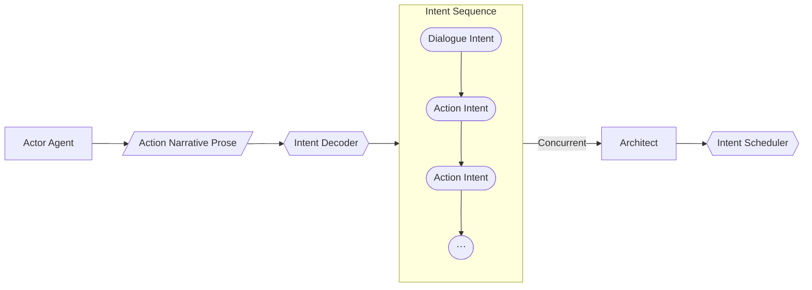

The simple way of understanding intents is to think of it as a proposal, not an effect.

Intents are:

- **Declarative** — they describe what the character intends, not the final outcome.
- **High-level** — they capture the gist of an action or dialogue.
- **Allowed to be wrong** — validation happens downstream.
- **Cheap to generate** — LLM-friendly structured output.

The actor LLM doesn't directly generate an intent. To keep the narrative going, the actor agent generates continuing prose. If the intents validate, the narrative prose goes directly to the user while deltas generated from the intents modify the state.



## Intent Decoder

The Intent Decoder:

- Splits narrative prose into multiple intents when applicable.
- Classifies each intent to its type (`dialogue`, `action`, or `monologue`).
- Parses narrative text into structured JSON with minimal information loss.
- Contextually resolves the receiving parties/targets.

### Zod Schemas & Types

- **IntentType**: `"dialogue"` | `"action"` | `"monologue"`
- **Intent**:
  - `type`: `IntentType`
  - `originalText`: `string` — the slice of raw prose text containing the intent
  - `description`: `string` — summarized intent action
  - `actorId`: `string`
  - `targetIds`: `string[]` — resolved recipient or target entity IDs
- **IntentSequence**:
  - `intents`: `Intent[]`

### IntentDecoder Class

```typescript
export class IntentDecoder {
  constructor(private llmProvider: ILLMProvider) {}

  async decode(
    worldState: WorldState,
    actorId: string,
    narrativeProse: string,
  ): Promise<IntentSequence>;
}
```

It serializes the world state and feeds all known entity IDs as context, enabling the model to resolve target IDs correctly.

## Names and LLMs

A fundamental issue emerged during early design: something as simple as a name is set to private. An entity's name is not common knowledge — you don't instantly know another person's name.

Although the internal system can identify an entity by its ID (defined in `AttributableObject`), UUIDs aren't helpful for LLMs. This creates several problems:

- **Unnamed entities**: How does the Architect orchestrate changes for an entity that doesn't even have a name?
- **Inconsistent identifiers**: An NPC might use "the hooded man" in one turn and "the shadowy figure" in the next.
- **Made-up names**: LLMs may invent names not present in the world state.

The **Subjective Alias System** solves this by maintaining a per-entity map from target IDs to subjective descriptors (see [Memory & Aliases](./memory)).
