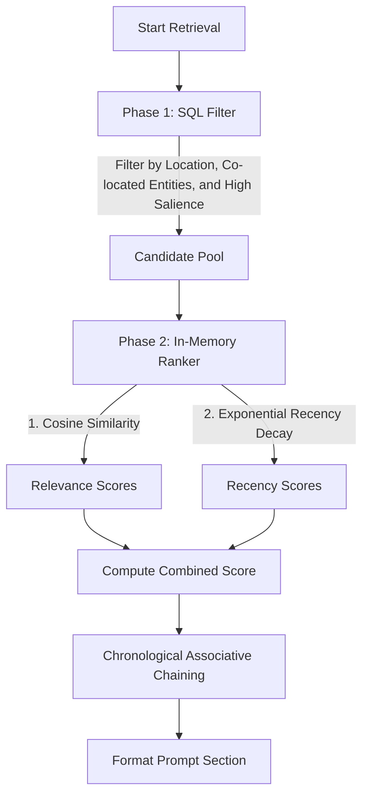

**Tier 2 Memory (the Ledger)** represents an entity's long-term episodic memory. It archives historical summaries of past events, providing a persistent record of character experiences that can be retrieved and injected into LLM prompts as needed.

---

## 1. Data Model

A long-term memory is represented by a `LedgerEntry`. It includes metadata for deterministic database-level filtering, structured narrative content, and vector embeddings for semantic similarity scoring.

```ts
interface LedgerEntry {
  id: string;
  ownerId: string; // The entity to whom this subjective memory belongs
  timestamp: string; // ISO timestamp matching the WorldClock at event time
  locationId: string | null; // Location where the event transpired
  involvedEntityIds: string[]; // Other entity IDs present during the event

  content: string; // Third-person narrative summary of the event
  quotes: string[]; // Verbatim dialogue lines of high narrative salience
  importance: number; // Salience score from 1 (trivial) to 10 (life-altering)
  embedding: number[]; // 768-dimensional vector embedding of the content
}
```

---

## 2. Storage Model

To support fast, low-latency queries across large historical datasets, Tier 2 memory is stored in standard SQLite tables. Vector embeddings are stored in raw binary format as `Float32Array` BLOBs.

Standard secondary indices optimize query execution time to microseconds, eliminating the compilation and cross-platform installation overhead of native vector database extensions (such as `sqlite-vec` or `node-gyp` binaries).

```sql
CREATE TABLE IF NOT EXISTS ledger_entries (
  id TEXT PRIMARY KEY,
  owner_id TEXT NOT NULL,
  timestamp TEXT NOT NULL,
  location_id TEXT,
  content TEXT NOT NULL,
  quotes_json TEXT,
  importance INTEGER NOT NULL,
  embedding BLOB,
  FOREIGN KEY (owner_id) REFERENCES objects(id) ON DELETE CASCADE
);

CREATE TABLE IF NOT EXISTS ledger_involved_entities (
  entry_id TEXT NOT NULL,
  entity_id TEXT NOT NULL,
  PRIMARY KEY (entry_id, entity_id),
  FOREIGN KEY (entry_id) REFERENCES ledger_entries(id) ON DELETE CASCADE
);

CREATE INDEX IF NOT EXISTS idx_ledger_owner ON ledger_entries(owner_id);
CREATE INDEX IF NOT EXISTS idx_ledger_location ON ledger_entries(location_id);
CREATE INDEX IF NOT EXISTS idx_ledger_importance ON ledger_entries(importance);
CREATE INDEX IF NOT EXISTS idx_ledger_involved_entity ON ledger_involved_entities(entity_id);
```

---

## 3. The Handoff Pipeline

Working memory (Tier 1 Buffer) entries are promoted to the Ledger through the automated [Handoff Pipeline](./handoff).

During handoff:

1. Candidate entries are clustered into narrative beats.
2. Ambient stage business and redundant details are pruned.
3. Chunks are synthesized into third-person summaries and assigned importance scores.
4. Text embeddings are generated for the summary.
5. The processed memories are committed to the SQLite store, and the short-term buffer is pruned.

---

## 4. Retrieval Architecture

To prevent context window overflow and contain inference costs, memory retrieval is split into a fast database query phase followed by an in-memory ranking phase.



### Phase 1: Deterministic Heuristic Filtering

The primary selection uses indexes to retrieve a candidate pool (capped at 100 entries) from the database:

1. **Spatial Cues**: Fetch entries matching the character's current `locationId`.
2. **Social Cues**: Fetch entries where `involvedEntityIds` intersects with entities currently inside the character's perception radius.
3. **High Salience**: Always retrieve high-salience entries where `importance >= 8`.

### Phase 2: Semantic & Episodic Ranking

Once the candidate pool is loaded, the ranking engine evaluates entries in application memory:

1. **Semantic Similarity**: Cosine similarity is computed directly in JS/TS memory between the current prompt context and the candidate embeddings.
2. **Multi-Factor Scoring**: Candidates are ranked using a weighted linear combination:
   $$\text{Score} = (\alpha \times \text{recency}) + (\beta \times \text{importance}) + (\gamma \times \text{relevance})$$
   - **Recency** is modeled via exponential decay based on elapsed simulation hours: $\text{decayRate}^{\text{hoursElapsed}}$.
   - **Importance** is the normalized salience score (1-10) assigned during handoff.
   - **Relevance** is the cosine similarity score.
3. **Chronological Associative Chaining**: When a memory is selected, the system automatically pulls in its adjacent chronological neighbors (preceding and succeeding ledger entries) to preserve episodic continuity in the prompt.

---

## 5. Active Focus & Attention Loop

In crowded settings (e.g., a room with many characters), retrieving long-term memories for all co-located entities would exhaust the prompt context window. To prevent this, retrieval uses an **Active Focus** selection strategy:

- **Active Focus Set**: The prompt builder scans the last 10 entries of the character's working memory buffer. Any entity targeted by, spoken to, or mentioned in these entries is added to the Active Focus set.
- **Dynamic Capacity Limits**:
  - If the number of co-located characters is small ($\le 3$), long-term memory is retrieved for all of them.
  - If the environment is crowded ($> 3$), long-term retrieval is strictly restricted to the top 3 characters in the Active Focus set.
- This creates a realistic attention loop: when a new character interacts with the actor, they enter the working buffer, triggering the retrieval of their long-term history on the subsequent turn.

---

## 6. Prompt Formatting

Retrieved ledger entries are formatted into the prompt chronologically and mapped to subjective aliases. Internal metrics (e.g., importance numbers and raw system IDs) are omitted to preserve immersion.

- Working memory entries are injected under `=== RECENT EVENTS ===` (narrated relative to the present moment).
- Recalled ledger entries are injected under `=== YOUR MEMORIES ===` (presented as long-term recollections).

```text
=== RECENT EVENTS ===
Moments ago
  - You spoke to Strider: "Hello there"

=== YOUR MEMORIES ===
A couple days ago
  - You met a hooded figure named Strider at The Prancing Pony.
    Quote: "I can avoid being seen, if I wish, but to disappear entirely, that is a rare gift."
```
