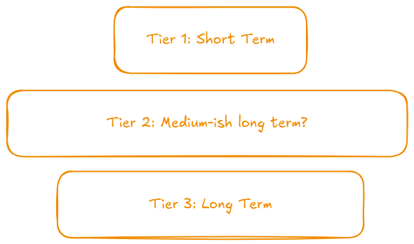

Memory has always been a core part of Omnia's architecture. I've always leaned towards a three tier system and it feels good to finally have a system frozen that's not subject to any more dramatic shifts.

Up until now, I had been juggling terms like "short-term", "long-term", "buffer", "ledger" and memory quite randomly and interchagebly. Not just that, I think even [NLAVS](https://github.com/sortedcord/NLAVS) is also guilty of this.

## How it was

Notice how the tier 2 bar is the longest here. This made sense to me. You'd have a short term memory structure, ideally for events that are happening in real time and this would be small. At any given time you can't realistically carry a lot of information. And then at the bottom we have the long term tier. And just to make the graph complete, there's this intermediate layer which would contain most of the memories of an agent.

Sounded right on markdown and looked cool in excali. But once you start talking about how they actually work, how does a unit of memory actually go between these layers is when all hell breaks loose. This wasn't something I paid much attention towards.

## A colorful diagram that's a wanna be complex flowchart

While developing [Handoff](../architecture/handoff.md); which is the mechanism for promoting "short term" memories to "long term" memories I realized that blindly modelling this after how humans are supposed to remember isn't a good approach to this, or rather, I'd say is a naiive solution to a data engineering problem.

Don't let this fool you. I didn't just move boxes around, add new boxes and renamed stuff and called it a day (even though that's what i did ;). But the main realization I had and the main framework that Omnia will follow from now on out is that **memories for an agent shouldn't be discrete rather they should be episodic.**

When one remembers something, they don't remember it in isolated bits and pieces. You remember them in sequences that are chained together. Remembering something often leads to remembering events that either caused it or were caused by it. Like a chain. This chain is the episode this is what makes Omnia's memory system different: **Memory isn't pure hierarchy.**

Each tier of memory serves its own purpose and has its own benefits and trade-offs but integrating them well together allows them to complement each other quite well.

Putting this diagram into words:

1. [**Tier 1: Cognitive Buffer**](../architecture/memory.md) is basically how the agent perceives its surroundings as-is. It is analgoues to a vision to text thing where whatever the agent "sees" is written down here, in the sense that this is high resolution and very verbose. So it contains actions, dialogues of others and itself but also its own thoughts, feelings, monologues.
2. [**Handoff**](../architecture/handoff.md) is what determines how important each event in the cognitive buffer is to be promoted to Memories. It's also responsible for compressing multiple actions into a single Memory Ledger entry.
3. [**Tier 2: Memory Ledger**](../architecture/memory-tier2.md) contains the bulk of an agent's memory. All memories are stored by when it happened, where it happened and who/what were involved in it. Given the size it will grow to, there was a need to implement a retrieval system (more than 1 of them).
4. [**Tier 3: Dossiers**](../architecture/) is the component of Omnia that allows for a per-actor subjective reality mapping. Every fact an actor knows whether it's about themselves or something else is stored as a dossier.

Dossiers also dictate what series of memories from the memory ledger populate the context for an actor allowing for episodic retreival of memories alongside the general ledger retriever that works on semantic similarity.

The main difference between the cognitive buffer+memory ledger and dossiers is that the former are immutable. Once something happens, it stays in the memory. It can become less relevant or harder to remember overtime (through time decay) but it stays in the memory as an immutable form.

Dossiers however, are mutable. They are an ever-changing object in the actor's memory that define what they think about something at that intance of time. This 'thought' or 'impression' can be about anything - themselves, another actor, location, abstract idea, etc.
